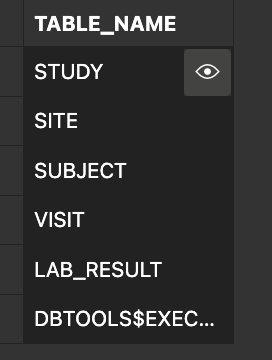
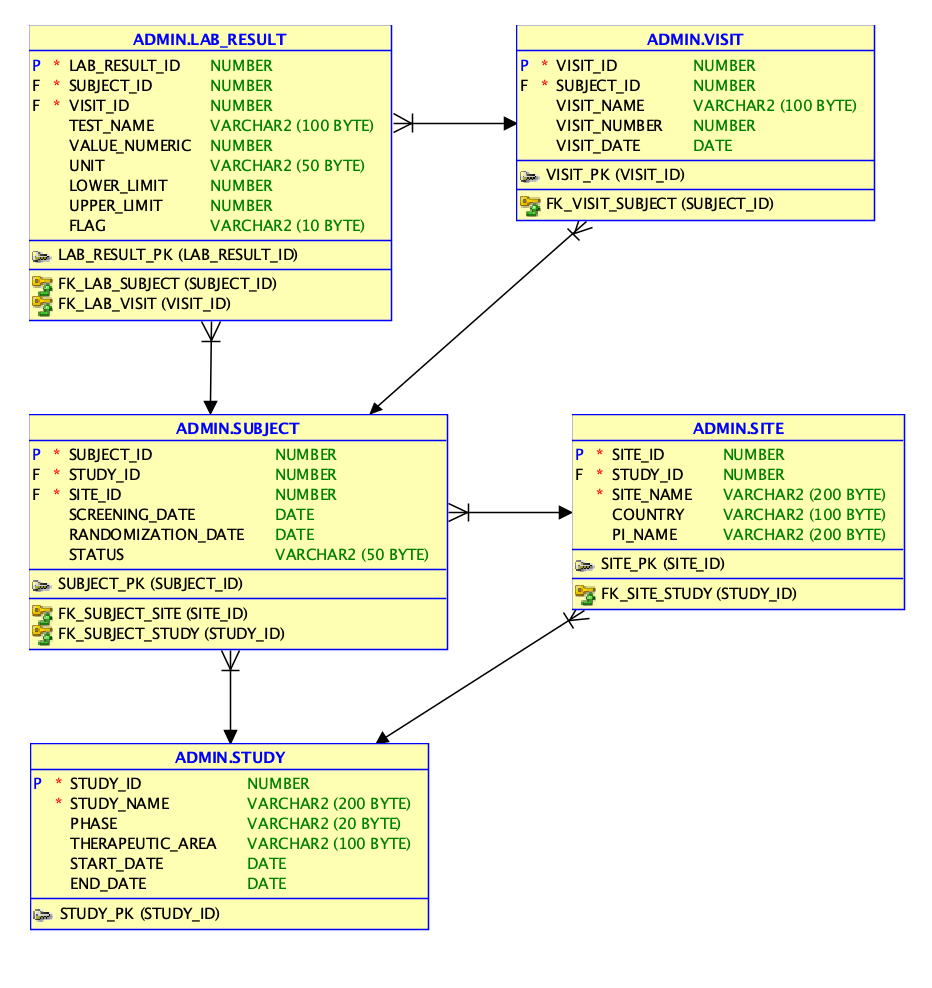
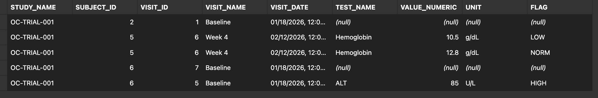

# oracle-clinical-trial-data-mgmt-on-oci
Implementation of a cloud solution on Oracle Cloud Infrastructure (OCI) to support clinical trial data capture and reporting, inspired by Oracle Clinical / Remote Data Capture.

## Screenshots

### OCI Autonomous Database

### Clinical Schema Tables

### ER Diagram

### Joined Clinical Query

### Out-of-Range Lab Results

## Project Management

This repository is managed using a GitHub Project board (Kanban):

- Columns: Backlog → In Progress → In Review → Done
- Work items: requirements definition, OCI setup, data modeling, test queries, documentation

The board demonstrates how Oracle Cloud implementation work can be broken into epics and tracked through to completion, similar to enterprise Oracle Cloud project delivery practices.
